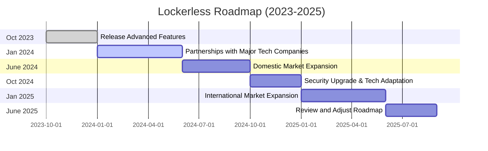

# [lockerless.com - your secret box](https://www.lockerless.com/)

Lockerless is Trusted single-use box for encrypted messages. 

## Motto

+ "Disposable Safe"
+ "Single-Use Vault"
+ "Your secret box"

Considering these impressions, **"Single-Use Vault"** may be the best choice if the emphasis is on strong security and the idea of each message being as secure as valuables in a bank vault. However, if the company wants to stress the temporary and disposable nature of the service more, **"Disposable Safe"** might be a better fit. **"One-Time Safe"** strikes a balance between the two and might be chosen if a compromise between security and disposability is desired. 

## LockerLess?

LockerLess is a user-friendly SaaS platform offering secure, encrypted communication and file exchange, with end-to-end encryption to ensure that messages and attachments can only be accessed by intended recipients. Users can conveniently encrypt their content on any device via a web interface or mobile app, share it through a secure link, and recipients can securely decrypt the message and files in the LockerLess securebox using a decryption key or password.

## How it works?
LockerLess is a SaaS (Software as a Service) platform designed for secure, encrypted communications with exchange files.
It provides users with a way to send messages and attachments that are protected with end-to-end encryption, ensuring that only the intended recipients can access and read them. 

Using LockerLess would typically involve either a web-based interface or a mobile app where users can create a message, 
attach any files if needed, and then encrypt the entire package with a simple "copy-paste/share" mechanism. Here’s how it would work across devices and get back the secure link (url).
Recipients of the secure link can then access the LockerLess securebox, where they will be able to decrypt the message and download any attachments using a decryption key or a password.

This process ensures that sensitive information remains confidential from the moment it's sent to when it's received.

1. **On a Computer:**
   - Access the LockerLess web platform.
   - Write your message and attach files.
   - Click on "Encrypt" to secure the content.
   - The service generates a secure link.
   - Copy the link and paste it into an email, chat, or any other form of communication.

2. **On a Mobile Device:**
   - Open the LockerLess app.
   - Enter your message and attach files directly from your device's storage.
   - Tap "Encrypt" and wait for the service to create a secure, shareable link.
   - Share the link via SMS, messaging apps, or email using the built-in share options in your device.

## Mission

Our mission at Lockerless is to provide top-notch, trustworthy encrypted messaging solutions. 
We are committed to enhancing communication security and confidentiality, ensuring your messages stay between you and your intended recipients.

## Vision

Our vision is to become the global leader in single-use trusted boxes for encrypted messages. 
We envision a digitally secure world where every message transferred is encrypted and kept safely, providing peace of mind to our users.

## Strategy

Our strategy involves four major thrusts: 

#### Expanding Technology:
We will invest in advanced encryption technology and innovative security features, constantly enhancing our product.

#### Partnerships:
We will form strategic alliances with top tech companies to increase our reach and adapt to the latest technologies.

#### Network:
Expand into new markets domestically and internationally, making our solutions accessible globally.

#### Customer Centricity:
Continually improve the user experience, making our products seamless and easily integrated into other platforms.

## Roadmap (2023-2025)

**October 2023:** 
Release advanced features of Lockerless and revamp user experience based on customer feedback.

**January 2024:** 
Partnership with major tech companies to enhance product capabilities, exploring options for integration.

**June 2024:** 
Expansion into new domestic markets and enhancing customer support, creating brand proponents.

**October 2024:** 
Advanced security upgrade and adapting to latest encryption technologies.

**January 2025:** 
Entering international markets, making Lockerless a global encrypted message box solution.

**June 2025:** 
Review progress and strategies, and adjust the roadmap for the next phase of growth based on previous results.

Note: The Roadmap is subject to change based on market trends, technology advancements, and user feedback. We believe in flexible strategies to keep pace with the ever-evolving tech landscape.

---

